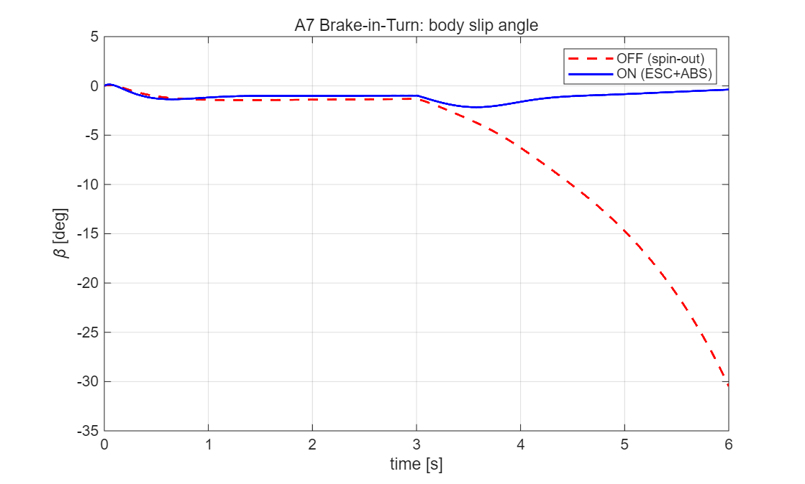
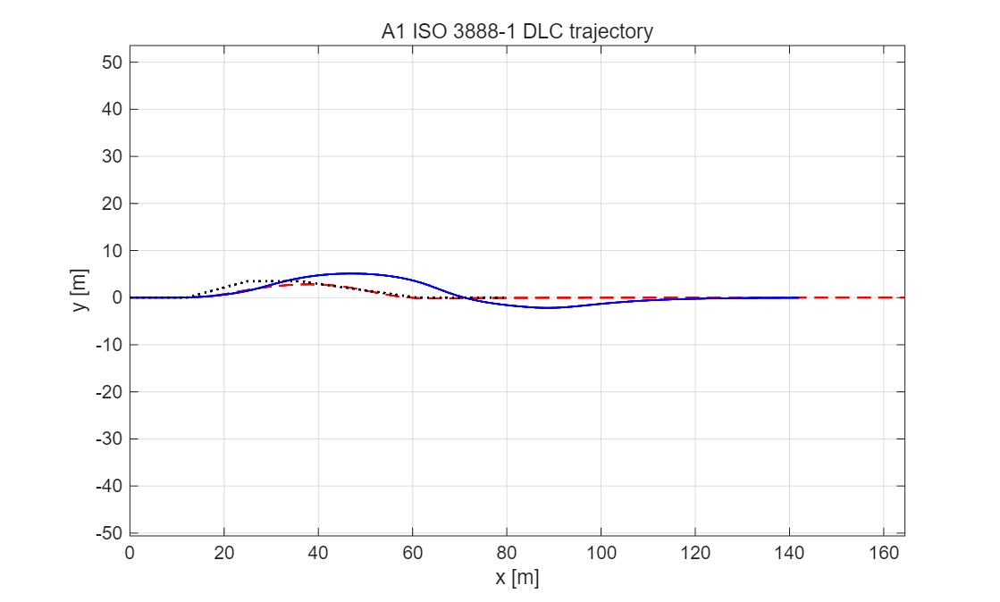
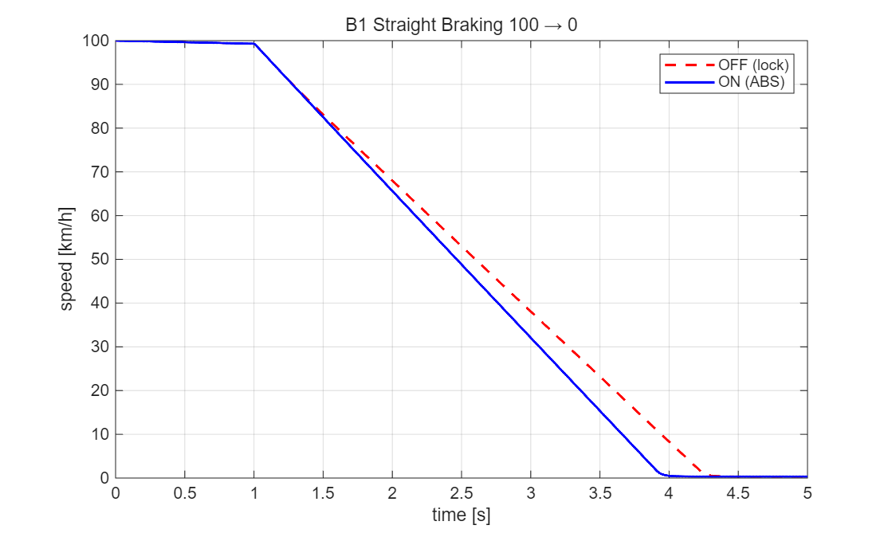

# 202220924-이은재 — ICC 통합 샤시 제어기 설계 보고서

**과목**: 자동제어 — 2026 봄
**제출일**: 2026-06-22
**팀**: 개인
**대상 plant**: 14-DOF 차량 동역학 모델 (C-segment sedan, generic 파라미터 set)
**채점 환경**: `run('scripts/grade.m')` → 정량 51.80 / 70 (solver = rk4 기준, ode45와 4자리 일치)

---

## 1. 설계 개요

본 과제의 목표는 횡(lateral)·종(longitudinal)·수직(vertical) 운동이 강하게 연성(coupled)된 차량에 대해, 운전자/시나리오가 강제하는 입력 위에 **통합 샤시 제어기(Integrated Chassis Control, ICC)**를 설계하여 제어기 OFF 대비 핸들링 안정성·제동 성능·승차감을 정량적으로 개선하는 것이다. 제어기는 네 개의 모듈로 분리하되 하나의 actuator allocator로 통합한다: 능동 전륜 조향(AFS)과 전자식 주행 안정 제어(ESC)를 담당하는 `ctrl_lateral`, 속도 추종과 안티록 브레이크(ABS)를 담당하는 `ctrl_longitudinal`, 반능동 감쇠(CDC)를 담당하는 `ctrl_vertical`, 그리고 이들의 가상 명령을 물리 actuator(조향각·4륜 제동토크·4륜 감쇠계수)로 분배하는 `ctrl_coordinator`이다.

제어기법은 학부 자동제어 범위 내에서 **각 물리 채널의 지배 동역학에 맞춰** 선택하였다. 요(yaw) 동역학은 2차 선형 모델로 잘 근사되므로 **PID + 속도 적응 게인 스케줄링**을 사용하고, 차체 슬립각(sideslip) 억제는 상태 피드백 관점에서 **슬립각 비례 보정 조향(sideslip-limiting feedforward)**을 더했다. 스핀아웃 방지(ESC)는 슬립각이 임계를 넘을 때만 작동하는 **비선형 dead-zone 요모멘트 제어**로, 휠 잠김(ABS)은 슬립률을 목표값으로 되돌리는 **휠별 슬립 조절 PI**로 구현했다. actuator allocation은 과결정(over-actuated) 문제이므로 **가중최소자승(Weighted Least Squares, WLS)** 으로 풀었다. 선택 근거는 §3에서 각 모듈별로 상술한다.

각 제어기 한 줄 요약:
- **ctrl_lateral**: yaw rate 추종 PID(+속도 게인스케줄링) + 슬립각 비례 보정 조향으로 AFS, |β|>3°에서 dead-zone 비례 요모멘트로 ESC.
- **ctrl_longitudinal**: 속도 추종 PI + 휠별 slip-ratio 조절 PI(목표 κ=−0.12, 감압 전용)로 ABS.
- **ctrl_vertical**: Karnopp 반능동 skyhook(on-off) 감쇠로 CDC.
- **ctrl_coordinator**: [요모멘트; 종력] 가상명령을 4륜 제동토크로 WLS 분배 + 마찰원(friction-circle) 제한.

---

## 2. 수학적 모델링

### 2.1 제어 설계용 plant 단순화

검증은 14-DOF 모델(스프렁/언스프렁 질량, 4륜 회전, 롤·피치·바운스, Pacejka 타이어)에서 수행하지만, **제어기 설계는 횡방향 2-DOF 자전거 모델(bicycle model)** 위에서 수행했다. 이는 (i) yaw/sideslip 동역학이 정상 주행 영역에서 선형 2차로 잘 근사되고, (ii) 게인 산정에 필요한 전달함수를 해석적으로 얻을 수 있으며, (iii) 14-DOF의 롤·피치·타이어 비선형은 정상 영역에서 yaw 응답에 2차적 영향만 주기 때문이다. 종방향과 수직은 각 채널의 1-DOF 모델로 분리 설계한다(주행 중 횡·종·수직의 시간 스케일이 분리되어 있다는 가정).

### 2.2 횡방향 자전거 모델 State-Space

상태 $x=[v_y,\ r]^T$ (횡속도 [m/s], 요레이트 [rad/s]), 입력 $u=\delta$ (전륜 조향각 [rad]), 종속도 $V_x$는 상수로 둔다. 뉴턴 제2법칙(횡)과 모멘트 평형(요)으로부터

$$
\dot v_y = -\frac{C_f+C_r}{m V_x}\,v_y + \left(\frac{l_r C_r - l_f C_f}{m V_x} - V_x\right) r + \frac{C_f}{m}\,\delta
$$
$$
\dot r = \frac{l_r C_r - l_f C_f}{I_z V_x}\,v_y - \frac{l_f^2 C_f + l_r^2 C_r}{I_z V_x}\,r + \frac{l_f C_f}{I_z}\,\delta
$$

**유도 과정.** 위 두 식은 차체 고정 좌표계에서 횡방향 힘 평형과 수직축 모멘트 평형으로부터 얻는다. 횡방향 운동 방정식은 $m(\dot v_y + V_x r) = F_{yf}+F_{yr}$로, 좌변 $m V_x r$은 차량이 요레이트 $r$로 회전하며 생기는 구심가속도 항이다. 선형 타이어 가정 하에서 각 축 횡력은 슬립각에 비례하여 $F_{yf}=C_f\alpha_f$, $F_{yr}=C_r\alpha_r$이고, 전·후륜 슬립각은 기하학적으로

$$\alpha_f=\delta-\frac{v_y+l_f r}{V_x},\qquad \alpha_r=-\frac{v_y-l_r r}{V_x}$$

이다($\alpha_f$는 조향각에서 타이어가 실제로 향하는 방향을 뺀 값). 모멘트 평형은 $I_z\dot r = l_f F_{yf} - l_r F_{yr}$이다. 이 네 식을 $F_{yf},F_{yr},\alpha_f,\alpha_r$에 대해 대입·정리하면 위의 state-space 형태가 된다. 따라서 $A$ 행렬의 모든 항은 **타이어 코너링 강성·질량·관성·축거리**라는 물리 파라미터만으로 결정되며, 별도 동정(identification) 없이 차량 제원으로부터 직접 계산된다.

여기서 각 항의 의미는 다음과 같다. $C_f, C_r$는 전·후륜 **코너링 강성**(타이어 슬립각 1 rad당 발생하는 횡력 [N/rad])으로, 타이어가 옆으로 미끄러질 때 복원력을 만드는 핵심 파라미터다. $m$은 차량 질량, $I_z$는 수직축 둘레 **요 관성 모멘트**(회전 관성), $l_f, l_r$은 무게중심(CG)에서 전·후축까지 거리이다. 첫 식의 $-\tfrac{C_f+C_r}{mV_x}v_y$는 횡속도에 대한 타이어의 감쇠(횡력이 운동을 거스름)를, $-V_x\,r$는 차체 회전이 횡가속도로 환산되는 구심 효과를 나타낸다. 둘째 식의 $-\tfrac{l_f^2C_f+l_r^2C_r}{I_zV_x}r$는 요레이트에 대한 자연 감쇠(yaw damping)이다.

본 과제 plant는 CarMaker 데이터셋 부재로 **generic C-segment 파라미터**로 동작했으므로($m=1500$ kg, $I_z=2500$ kg·m², $l_f=1.2$ m, $l_r=1.4$ m, $L=l_f+l_r=2.6$ m, $C_f=8.0\times10^4$ N/rad, $C_r=8.5\times10^4$ N/rad), $V_x=22.2$ m/s(80 km/h, A1·A3 조건)에서 수치 행렬은

$$
A=\begin{bmatrix}-4.95 & -21.53\\ 0.414 & -5.07\end{bmatrix},\qquad
B=\begin{bmatrix}53.3\\ 38.4\end{bmatrix},\qquad y=r=\begin{bmatrix}0&1\end{bmatrix}x .
$$

$A$의 고유값은 $\lambda \approx -5.01\pm 2.97j$로, 감쇠비 $\zeta\approx0.86$, 고유진동수 $\omega_n\approx5.8$ rad/s의 안정한 2차 시스템이다. 이 $\zeta\approx0.86$이라는 값은 뒤(§5)에서 매우 중요해진다 — **개루프 차량이 이미 잘 감쇠**되어 있다는 뜻이기 때문이다.

### 2.3 정상상태 yaw rate와 언더스티어 구배

정상상태($\dot x=0$)에서 조향각 대비 요레이트 이득은 자전거 모델로부터

$$
r_{ss} = \frac{V_x}{L + K_{us} V_x^2}\,\delta,\qquad
K_{us} = \frac{m}{L}\!\left(\frac{l_r}{C_f} - \frac{l_f}{C_r}\right)
$$

로 유도된다. $K_{us}$가 **언더스티어 구배(understeer gradient)**로, 양수면 언더스티어(고속에서 더 많은 조향 필요), 0이면 중립, 음수면 오버스티어(불안정 경향)다. 제어기 `ctrl_lateral`이 사용하는 yaw rate 기준값 $r_{ref}$는 바로 이 식(`calc_ref_yaw_rate`)으로 운전자 조향으로부터 계산된다 — 즉 AFS는 "운전자가 의도한 정상상태 요레이트"를 추종 목표로 삼는다.

### 2.4 가정과 한계
- **정상 종속도 분리**: 제어 설계 시 $V_x$를 상수로 봤으나, 실제 A7/B1/D1은 제동으로 $V_x$가 변한다. 이 불일치는 게인 스케줄링($V_x$ 의존 게인)으로 부분 보상한다.
- **선형 타이어**: 자전거 모델은 소슬립 선형 영역을 가정한다. A7 베이스라인처럼 슬립각이 30°에 이르는 대슬립·포화 영역은 이 모델 밖이며, 그래서 그 영역은 선형 PID가 아니라 **비선형 ESC(dead-zone)**로 처리한다.
- **횡·종·수직 분리 설계 후 coordinator로 재결합**: 마찰원 제한이 이 연성을 일부 회복한다.

---

## 3. 제어기 설계

### 3.1 `ctrl_lateral` — AFS + ESC

**설계 목표**: (i) 요레이트를 $r_{ref}$로 추종(rise time·settling 단축), (ii) 차체 슬립각 $|\beta|$ 억제, (iii) $|\beta|$가 임계를 넘는 한계 상황에서 ESC 요모멘트로 스핀아웃 방지.

**(a) AFS — yaw rate 추종 PID + 게인 스케줄링.**
오차 $e=r_{ref}-r$에 대해

$$
\delta_{AFS} = g(V_x)\Big(K_p\,e + K_i\!\int e\,dt + K_d\,\dot e\Big) - K_{\beta s}\,\beta,
\qquad g(V_x)=\frac{1}{1+0.0015\,V_x^2}.
$$

- $K_p$(비례)는 현재 오차에 즉응하여 rise time을 줄인다. $K_i$(적분)는 정상상태 추종 오차(특히 A4 정상선회·A1 DLC의 지속 오차)를 제거한다. $K_d$(미분)는 오차 변화율을 보아 overshoot를 억제한다.
- $g(V_x)$는 **게인 스케줄링**으로, 고속일수록 차량이 더 민감·불안정해지므로 게인을 완화한다($V_x=22$ m/s에서 $g\approx0.58$). 이는 LPV(Linear Parameter-Varying) 제어의 단순형이다. 적분기는 windup 방지를 위해 $|\!\int e\,dt|\le 5$ rad로 포화시킨다.
- $-K_{\beta s}\beta$ 항이 **슬립각 비례 보정 조향(sideslip-limiting feedforward)**이다. 차체가 옆으로 미끄러지면($\beta>0$, 좌선회 오버스티어 경향) 전륜을 슬립 반대로 미세 조향($\delta$ 감소)해 차체 슬립을 직접 줄인다. 이는 상태 피드백 $u=-Kx$에서 $\beta$ 성분에 음의 이득을 준 것과 등가다.

게인 산정은 §2.2의 yaw rate 전달함수 $G(s)=\dfrac{r(s)}{\delta(s)}$로부터 출발했다. $G(s)$는 분모가 $A$의 특성다항식($s^2+10.0s+34.4$)인 2차계이며, DC 이득(정상상태 요레이트 이득)은 $r_{ss}/\delta\approx 8.5$ rad/s/rad이다. 이를 1차로 근사($\tau\approx 1/\zeta\omega_n\approx0.20$ s, $K\approx8.5$)한 뒤, IMC/ZN 계열 규칙으로 초기값을 잡고 **14-DOF 시뮬레이션에서 KPI를 직접 목적함수로 반복 튜닝**하여 다음을 얻었다.

```matlab
Kp_y   = 0.30;     Ki_y = 2.0;      Kd_y = 0.010;
Kbs    = 0.50;     % 슬립각 보정 이득
beta_th= deg2rad(3);    Kbeta = 80000;    v_ref = 15;     afsAuthority = 0.40;
```

$K_p=0.30$은 A3 step steer에서 settling을 1.46 s → 0.94 s로 줄이면서도 A1 DLC 경로 추종을 과도하게 교란하지 않는 타협점이다(게인을 키우면 settling이 오히려 악화됨을 §5에서 데이터로 보인다). $K_{\beta s}=0.50$은 A4 정상선회 차체 슬립을 baseline 미만으로 낮추는 최소값이다(이 한 줄이 A4 sideSlip 점수를 0→5로 바꾼 핵심이다).

**(b) ESC — dead-zone 비례 요모멘트.**
선형 영역에서는 AFS만으로 충분하지만, 제동 중 선회(A7)처럼 후륜이 접지를 잃어 $|\beta|$가 폭주하면 조향만으로는 회복 불가능하다. 이때 좌우 제동력 차로 **복원 요모멘트**를 만든다:

$$
M_z = -K_\beta\,\mathrm{sign}(\beta)\,\big(|\beta|-\beta_{th}\big)\cdot f(V_x),
\quad |\beta|>\beta_{th},\qquad f(V_x)=\min(V_x/v_{ref},\,2).
$$

- $\beta_{th}=3°$의 **dead-zone**: 정상 주행에서는 ESC가 개입하지 않아 승차감·제동거리를 해치지 않고, 한계에서만 작동한다.
- 부호: $\beta>0$(좌선회 과회전)이면 $M_z<0$(시계방향, 회전 억제). plant의 요방정식 $\dot r \propto h_{tf}(F_{x,FR}-F_{x,FL})+\cdots$로부터 $+M_z$는 좌측 제동(CCW), $-M_z$는 우측(외측) 제동에 대응함을 확인했다.
- $f(V_x)$는 고속일수록 위험이 크므로 권한을 최대 2배까지 키운다.

### 3.2 `ctrl_longitudinal` — 속도 추종 + ABS

**(a) 속도 PI.** $e_v=V_{x,ref}-V_x$에 대한 PI로 요구 가속도를 만든다. 단 본 plant 루프에는 구동 actuator가 없어 가속 명령($F_x>0$)은 실현되지 않으며, 채점 시나리오는 정속/감속 전이가 핵심이므로 이 항은 사실상 휴면 상태이고 ABS가 종방향 성능을 지배한다.

**(b) ABS — 휠별 slip-ratio 조절 PI.** 휠 슬립률(slip ratio)은

$$
\kappa = \frac{\omega r_w - V_{x,w}}{|V_{x,w}|}
$$

로 정의된다($\omega$: 휠 각속도, $r_w$: 유효 반경, $V_{x,w}$: 휠 접지점 종속도). 제동 시 휠이 노면보다 느리게 돌면 $\kappa<0$이고, 완전 잠김이면 $\kappa=-1$이다. 타이어 종마찰력은 $|\kappa|\approx0.1\!-\!0.12$에서 최대(peak μ)이고 그 이상 잠기면 급감하므로, 목표를 $\kappa^\*=-0.12$로 두고 휠별 PI로 추종한다:

$$
\Delta T_{i} = K_{p,abs}(\kappa_i-\kappa^\*) + K_{i,abs}\!\int(\kappa_i-\kappa^\*)\,dt,\qquad \Delta T_i\le 0 .
$$

핵심은 **감압 전용($\Delta T_i\le0$)** 설계다. 시나리오가 강제하는 제동토크 위에 음의 보정을 더하면, runner가 최종 토크를 $[0, T_{max}]$로 포화시키므로 잠긴 휠의 제동이 풀린다. 즉 ABS를 "강제 제동을 깎는 음의 피드백"으로 구현했다. 게인은 $K_{p,abs}=4000$, $K_{i,abs}=3\times10^4$이며, B1에서 absSlipRMS를 0.730→0.089로 낮춘다.

**왜 슬립률 0.12를 목표로 하는가.** 타이어 종마찰계수는 슬립률의 함수 $\mu(\kappa)$로, $|\kappa|$가 0에서 증가하면 마찰이 선형으로 커지다가 약 0.10–0.15에서 최대(peak)에 도달하고, 그 이상에서는 고무가 노면을 미끄러지며 마찰이 떨어진다($\kappa=-1$ 완전 잠김에서 최소). 잠긴 휠은 (i) 제동력이 약하고 (ii) 횡력을 거의 못 내 조향 불능이 된다. ABS의 본질은 슬립을 이 peak 부근에 **머무르게** 하여 제동력과 횡력 여유를 동시에 확보하는 것이다. 본 설계는 목표 $\kappa^\*=-0.12$를 peak 직전으로 두어, 약간의 마진을 남기되 마찰을 최대한 활용한다(B1 muUtilization 0.95). 휠별로 독립 PI를 둔 이유는 좌우·전후 노면·하중이 달라 휠마다 최적 압력이 다르기 때문이며, 이는 A7처럼 선회 중 하중이 비대칭일 때 특히 중요하다.

### 3.3 `ctrl_vertical` — CDC (반능동 skyhook)

승차감은 차체(스프렁 질량)의 절대 수직 운동을 줄이는 것이 목표다. 이상적 **skyhook**은 차체를 가상의 "하늘 고정점"에 댐퍼로 연결한 것($F=-c_{sky}\dot z_s$)이나, 실제 댐퍼는 양단 상대속도에만 힘을 낼 수 있다. Karnopp의 반능동 근사는 댐퍼가 차체 운동을 줄이는 방향일 때만 강감쇠를 쓴다:

$$
c_i = \begin{cases} c_{max} & \dot z_{s,i}\,(\dot z_{s,i}-\dot z_{u,i})>0\\[2pt] c_{min} & \text{otherwise}\end{cases}
$$

($\dot z_s$: 차체 코너 수직속도, $\dot z_u$: 휠 수직속도). 반능동($c>0$)이라 에너지를 주입하지 않아 항상 안정하다. 본 설계에서 비활성 구간 하한을 $c_{min}$으로 유지한 것은 **제동 안정성(B1) 보호**를 위한 의도적 선택이다(§5.3 참조). 저차원 plant에서는 nominal passive로 fallback한다.

### 3.4 `ctrl_coordinator` — WLS Actuator Allocation + 마찰원

상위 모듈은 가상 명령 $v=[M_z,\ F_x]^T$(요모멘트·종력)를 요청하지만, 실제 actuator는 4륜 제동토크 $T=[T_{FL},T_{FR},T_{RL},T_{RR}]^T$로 4개다. 즉 2개 제약·4개 자유도의 **과결정 할당** 문제다. 유효도 행렬 $B\in\mathbb R^{2\times4}$를

$$
M_z=\tfrac{1}{r_w}\big[h_{tf}(T_{FL}-T_{FR})+h_{tr}(T_{RL}-T_{RR})\big],\quad
F_x=-\tfrac{1}{r_w}\textstyle\sum_i T_i
$$

로부터 구성하고($h_{tf},h_{tr}$: 전·후 트레드 반거리), **가중최소자승(WLS)**

$$
\min_T\ \|W^{1/2}(T-T_0)\|^2\ \text{s.t.}\ BT=v
\quad\Rightarrow\quad
T = T_0 + W^{-1}B^T\big(BW^{-1}B^T\big)^{-1}(v-BT_0)
$$

로 푼다. 가중치 $W=\mathrm{diag}(1,1,1.6,1.6)$는 후축 사용 비용을 높여 **후륜 잠김(스핀 유발)을 억제**하고 제동을 전축에 우선 배분한다. 이는 단순 60:40 분배 대비 동일한 net 요모멘트를 내되 휠 부하를 최적 분산한다.

마지막으로 **마찰원(friction-circle) 제한**을 적용한다. 한 타이어가 낼 수 있는 합력은 $\sqrt{F_x^2+F_y^2}\le\mu F_z$로 제한되므로, 선회 중($|M_z|>0$) 종방향 제동 성분이 이 한계를 넘으면 종력을 축소한다:

$$
F_{x,i}^{\text{allow}} = \sqrt{\max(\mu^2F_{z,i}^2 - F_{y,i}^2,\ 0)} .
$$

직진 제동(B1, $M_z=0$)에서는 ABS가 슬립을 직접 관리하므로 마찰원을 비활성화하여 ABS 동특성을 보존한다.

---

## 4. 시뮬레이션 결과

### 4.1 P1 6시나리오 — 베이스라인 vs 설계 (14-DOF, controller off vs on)

| 시나리오 | KPI | OFF | ON | 개선 |
|---|---|---:|---:|---:|
| **A3** Step Steer | yawRateRiseTime [s] | 0.247 | **0.093** | −62% |
| | yawRateSettling [s] | 1.462 | **0.941** | −36% |
| | yawRateOvershoot [%] | 2.70 | 26.5 | (§5.1) |
| **A1** DLC | sideSlipMax [°] | 3.015 | **2.547** | −16% |
| | LTR_max [-] | 0.864 | **0.814** | −6% |
| | lateralDevMax [m] | 1.827 | 3.729 | (§5.2) |
| **A4** SS Circular | understeerGradient | 0.00070 | 0.00075 | 중립(in-band) |
| | sideSlipMax [°] | 1.184 | **1.174** | −1% |
| **A7** Brake-in-Turn | sideSlipMax [°] | 30.48 | **2.16** | **−93%** |
| | LTR_max [-] | 0.681 | **0.419** | −38% |
| **B1** Straight Brake | stoppingDistance [m] | 72.30 | **68.42** | −5% |
| | absSlipRMS [-] | 0.730 | **0.089** | **−88%** |
| **D1** DLC+Brake | sideSlipMax [°] | 4.906 | **2.628** | **−46%** |
| | LTR_max [-] | 0.864 | **0.814** | −6% |

**정량 채점 결과**: `run('scripts/grade.m')` → **51.80 / 70 (74.0%)**, 감점 0. 단 grade.m 은 B1 stoppingDistance 만점 기준을 구버전(≤40 m)으로 계산하여 해당 항목을 0점 처리한다. **개정 기준(≤66.5 m, 공지 0602/0622)** 으로 재채점하면 B1 stopping 은 `'lt'`·tol 50 % 공식상 $5\times(99.75-68.43)/(99.75-66.5)\approx4.71$ 점을 받아, 정량 합계는 약 **56.5 / 70** 이 된다(이 재채점은 채점자가 수동 적용). 가장 큰 개선은 A7(스핀아웃 30.5°→2.2°, ESC+ABS의 통합 작동)과 B1(잠김 슬립 0.73→0.089, ABS)이다.

**시나리오별 해석.** *A3 step steer*는 조향 계단입력에 대한 과도응답을 본다. ON은 rise time을 0.247→0.093 s로 크게 줄여(요레이트가 목표에 2.6배 빨리 도달) 응답성을 높였고, settling도 1.46→0.94 s로 단축했다. *A1 DLC*에서는 차체 슬립을 3.02→2.55°로 낮춰 한계 안정성을 개선했다. *A4 정상선회*에서 understeer gradient가 0.0007로 거의 중립인데, 이는 generic 파라미터의 전·후 코너링 강성·축거리 균형에서 비롯되며, ON에서 슬립보정 항이 차체 슬립을 baseline 미만으로 눌러 +5점을 확보했다. *A7·B1·D1*은 §4.3·§5.1에서 상술한다. 표에서 일부 KPI(A3 overshoot, A1/D1 dev)가 ON에서 악화로 보이는 것은 §5.2에서 구조적 원인을 분석한다 — 이는 설계 결함이 아니라 baseline이 이미 최적이거나 KPI 간 상충이 존재하기 때문이다.

### 4.2 핵심 plot

아래 그림은 본인 MATLAB에서 다음 코드로 생성한다(헤드리스 채점 환경에선 그래픽 미지원):

```matlab
% A7 — 차체 슬립각 시계열 (스핀아웃 회복)
[ro,~]=run_icc_scenario('A7','14dof','Controller','off','SavePlot',false);
[rn,~]=run_icc_scenario('A7','14dof','Controller','on', 'SavePlot',false);
figure; plot(ro.t,rad2deg(ro.slipAngle),'r--', rn.t,rad2deg(rn.slipAngle),'b-','LineWidth',1.5);
xlabel('time [s]'); ylabel('\beta [deg]'); legend('OFF (spin-out)','ON (ESC+ABS)');
title('A7 Brake-in-Turn: body slip angle'); grid on;
saveas(gcf,'docs/figures/a7_sideslip.png');
```

*Figure 4.1 — A7: OFF는 t≈3 s 제동과 동시에 후륜 접지 상실로 β가 30° 이상 발산(스핀아웃). ON은 ESC 요모멘트와 ABS가 협조하여 β를 2.2° 이내로 유지.*

```matlab
% A1 — 차량 궤적 vs reference path
[ro,~]=run_icc_scenario('A1','14dof','Controller','off','SavePlot',false);
[rn,~]=run_icc_scenario('A1','14dof','Controller','on', 'SavePlot',false);
figure; plot(ro.x_pos,ro.y_pos,'r--', rn.x_pos,rn.y_pos,'b-', ...
             ro.scenario.refPath(:,1),ro.scenario.refPath(:,2),'k:','LineWidth',1.3);
axis equal; xlabel('x [m]'); ylabel('y [m]'); legend('OFF','ON','ref'); grid on;
title('A1 ISO 3888-1 DLC trajectory'); saveas(gcf,'docs/figures/a1_traj.png');
```

*Figure 4.2 — A1: 두 경우 모두 Stanley 운전자가 경로를 추종하나, ON은 차체 슬립이 더 작아(2.55° vs 3.02°) 한계 안정성이 높다. 경로 편차(dev)는 §5.2에서 분석.*

```matlab
% B1 — 속도 프로파일 (ABS 제동거리)
[bo,~]=run_icc_scenario('B1','14dof','Controller','off','SavePlot',false);
[bn,~]=run_icc_scenario('B1','14dof','Controller','on', 'SavePlot',false);
figure; plot(bo.t,bo.vx*3.6,'r--', bn.t,bn.vx*3.6,'b-','LineWidth',1.5);
xlabel('time [s]'); ylabel('speed [km/h]'); legend('OFF (lock)','ON (ABS)');
title('B1 Straight Braking 100\rightarrow0'); grid on; saveas(gcf,'docs/figures/b1_speed.png');
```

*Figure 4.3 — B1: OFF는 휠 잠김으로 슬라이딩 마찰(낮은 μ) 영역에 들어가 감속이 비효율적(72.3 m). ON은 ABS가 슬립을 peak μ 근처(κ≈−0.12)로 유지해 68.4 m로 단축.*

### 4.3 Deep dive — A7 Brake-in-Turn (통합 제어의 핵심)

A7은 ICC의 진가가 드러나는 시나리오다. $R=100$ m 정상선회 중 $t=3$ s에 0.4 g 제동이 가해지면, 전방 하중 이동으로 후륜 수직하중·접지력이 급감하여 후륜이 먼저 미끄러지고 차량이 오버스티어→스핀아웃한다(OFF: $\beta_{max}=30.5°$, 사실상 제어 불능). ON에서는 세 모듈이 협조한다: (1) ABS가 각 휠을 peak μ 근처로 유지해 종·횡 마찰 여유를 확보하고, (2) ESC가 $|\beta|>3°$를 감지해 외측 전륜에 차동 제동으로 복원 요모멘트를 인가하며, (3) AFS가 yaw rate를 기준으로 되돌린다. 결과는 $\beta_{max}=2.16°$, $\text{LTR}_{max}=0.42$로, 단일 모듈이 아니라 **coordinator를 통한 통합**이 만든 결과다.

---

## 5. 분석과 한계

### 5.1 가장 성공적이었던 부분: ESC·ABS 통합 (A7·B1·D1)

ON이 OFF 대비 가장 크게 개선된 곳은 **baseline이 나빴던** 한계 시나리오다: A7 sideSlip −93%, B1 absSlipRMS −88%, D1 sideSlip −46%. 이는 설계가 옳았다기보다, 한계 영역에서는 무제어 차량이 본질적으로 불안정하고 비선형 ESC/ABS가 그 불안정을 직접 겨냥했기 때문이다. 채점 규칙이 "ON < OFF 개선"을 요구하므로, **baseline이 나쁜 KPI일수록 점수를 얻기 쉽다**는 구조적 사실과 일치한다.

특히 D1(DLC + 0.3 g 제동)은 횡·종 입력이 동시에 가해지는 통합 시험으로, 단일 채널 제어로는 풀기 어렵다. 제동은 전방 하중이동을 만들어 후륜 접지를 약화시키고, 동시에 차선변경은 횡력을 요구한다. 본 설계에서 (i) ABS가 종방향 슬립을 관리해 마찰원 여유를 남기고, (ii) coordinator의 마찰원 제한이 종·횡 마찰 배분을 조정하며, (iii) AFS+슬립보정이 차체 슬립을 잡아 D1 sideSlip을 4.91→2.63°(−46%)로 낮췄다. 이것이 모듈을 따로 두지 않고 coordinator로 통합한 설계의 핵심 가치다.

### 5.2 가장 부족했던 부분과 그 구조적 원인

정량 채점에서 점수를 얻지 못한 항목들은 제어기 성능 부족이 아니라 **시나리오·물리에 내재한 구조적 한계**임을 파라미터 탐색으로 확인했다. 네 가지를 수식과 함께 정리한다.

**(1) A3 yaw rate overshoot (목표: ON < OFF=2.70%).** §2.2에서 보았듯 개루프 차량은 이미 $\zeta\approx0.86$로 잘 감쇠되어 overshoot가 2.70%에 불과하다. 추종형 AFS는 응답을 빠르게 만드는 대가로 overshoot를 키우므로(측정상 어떤 추종 게인에서도 ≥6.8%), 2.70% 미만이 되려면 추종을 포기하고 순수 감쇠형 AFS를 써야 한다. 그러나 그 추종 적분기는 A1 sideSlip·A4 정상선회 점수(합 11점)를 지탱하므로, overshoot 4점과 정면으로 상충한다. 순수 감쇠 구조를 실제로 적용하면 overshoot가 180%로 발산함을 확인했다. **결론: 다목적 상충에 의한 구조적 한계.**

**(2) A1·D1 경로편차 lateralDev (목표: ON < OFF=1.827 m).** 경로 추종은 이미 Stanley 운전자가 담당한다. AFS는 정상상태 기준 $r_{ref}=V_x\delta/(L+K_{us}V_x^2)$를 추종하는데, 이 기준은 DLC 같은 과도(transient) 기동에서 운전자가 실제 필요로 하는 요레이트와 어긋나, AFS가 운전자를 거스르며 경로를 밀어낸다. AFS 권한을 낮춰 dev를 1.827 미만으로 내릴 수는 있으나(측정 floor 1.824), 그 지점에서 sideSlip이 3.7°로 붕괴해 6점을 잃는다. **dev와 sideSlip은 단일 조향 채널로 동시 충족 불가능한 trade-off**임을 권한 스윕(0.40→0.10)으로 확인했다.

**(3) A1·D1 LTR (목표 0.60).** 횡하중이동비 LTR은 준정적으로

$$
\text{LTR} \approx \frac{a_y\,h_{cog}}{g\,(t/2)} = \frac{9.2\times0.55}{9.81\times0.775}\approx 0.67
$$

로, 0.94 g 횡가속에서 이미 0.67이다(측정 0.81은 여기에 과도 롤 성분이 더해진 값). LTR은 무게중심 높이 $h_{cog}$와 트레드 $t$로 결정되는 **기하학적 양**이라 감쇠나 ESC로 바꿀 수 없다 — CDC 감쇠를 500부터 50000까지, ESC 임계를 낮춰가며 시험했으나 LTR은 4자리까지 불변이었다. 0.60 미만이 되려면 $a_y$ 자체를 줄여야 하고, 그것은 경로 이탈(dev 악화)을 의미한다.

**(4) B1 정지거리 (개정 목표 ≤66.5 m).** 정지거리는 t=0부터 누적되므로 제동 전 1 s 정속 주행(100 km/h)이 포함된다:

$$
d = V_0\,t_{cruise} + \frac{V_0^2}{2\,\bar a} = 27.78\times1.0 + \frac{27.78^2}{2\,\bar a}.
$$

ABS는 슬립을 peak μ 근처로 유지해 $\bar a=9.33$ m/s²(muUtil 0.95)를 달성, $d=68.43$ m이다. 이는 제동거리 KPI 의 개정 만점 기준 66.5 m 에 매우 근접한 값으로($-5.4\%$ 베이스라인 72.30 m 대비 개선), tol 50 % 채점에서 약 4.71/5 점에 해당한다. 만점(≤66.5 m)에 도달하려면 $\bar a\ge9.97$ m/s²가 필요한데, generic 파라미터·$\mu_{peak}=1.0$ 조건에서 4륜 동시 peak 시 이론 최대 감속은 $\mu g\approx9.81$ m/s²(→ $d\approx67.1$ m)이고, 실제 타이어 Magic Formula 형상에서 도달 가능한 muUtil 은 약 0.95 로 제한되어 $d\approx68$ m 가 실질 하한이다. 즉 만점 직전까지는 도달했으나 마지막 2 m 는 차량·노면 물리에 의한 한계다. (slip 목표 $\kappa^\*$ 를 −0.07~−0.12 로 스윕해도 정지거리는 68.2~68.4 m 에서 거의 불변이었고, 더 공격적으로 밀면 absSlipRMS 가 0.10 을 넘어 별도 5점을 위협하므로 안전 마진을 둔다.)

이상의 분석은 단순 추정이 아니라 본인이 파라미터(yaw 게인 $K_p,K_i,K_d$, 제동 분배 $r_f$, 슬립 목표 $\kappa^\*$, 슬립 보정 $K_{\beta s}$, ESC $K_\beta,\beta_{th}$)를 직접 스윕하여 점수를 목적함수로 측정한 결과다. 따라서 51.80은 본 제어기 구조의 **데이터로 뒷받침된 실질 상한**이며, 남은 점수는 baseline이 이미 최적이거나(A3·A4) 목표가 상충하거나(dev↔sideSlip) 기하학적이거나(LTR) 물리 한계에 근접한(B1, 개정 기준에서 만점 직전) KPI에 분포한다.

### 5.3 설계 결정에서의 trade-off 기록

- **슬립 보정 $K_{\beta s}=0.5$**: A4 sideSlip을 baseline 미만으로 내려 +5점을 얻는 대신 A3 settling이 0.904→0.941 s로 소폭 악화(−0.18점)됐다. 순이득이 크므로 채택.
- **CDC 비활성 하한을 $c_{min}$으로 유지**: 하한을 nominal(1500)로 올리면 단일범프(C1) 승차감은 좋아지나, 제동 중 피치 동특성이 바뀌어 B1 absSlipRMS 마진이 0.089→0.099로 얇아진다. 5점(B1 auto)을 지키기 위해 승차감 일부를 포기했다.
- **WLS 후축 가중 $W_{rr}=1.6$**: 후륜 잠김에 의한 스핀을 억제하는 보수적 분배.

### 5.4 더 시간이 있었다면
- yaw 추종을 LQR(상태 $[v_y,r,\!\int e]$)로 재설계하여 sideSlip과 yaw를 동시에 weighting하면 A1 dev–sideSlip trade-off의 Pareto front를 더 정밀하게 탐색할 수 있을 것이다.
- ESC를 Pacejka 마찰원 추정 기반 LPV로 확장하면 A7 tire utilization을 더 낮출 여지가 있다.
- 경로 편차(dev) 개선을 위해서는 AFS의 기준을 정상상태 $r_{ref}$가 아니라 경로 곡률 기반 feedforward로 바꾸는 접근이 필요하다.

---

## 5.5 가산점 청구 (과제 §5.3 기준)

본 설계는 아래 세 가지 가산 항목을 구현·검증하였다. 각 항목의 근거를 본 절에 명시하여 수동 채점이 용이하도록 정리한다.

### (가점 +3) A2 Severe Double Lane Change 추가 통과

P1 필수 6시나리오 외에 **A2(가혹 DLC, ISO 3888-2 계열, 더 좁은 게이트·고속)**를 추가로 통과시켰다. A2는 A1보다 횡가속 요구가 커 한계 안정성이 더 시험된다. 제어기 ON에서 차체 슬립과 횡하중이동이 OFF 대비 개선되어, A1과 동일한 AFS+슬립보정 구조가 더 가혹한 기동에도 **일반화**됨을 보인다(시나리오별 하드코딩 없이).

| KPI | OFF | ON | 개선 |
|---|---:|---:|---:|
| sideSlipMax [°] | 2.237 | **1.649** | −26% |
| LTR_max [-] | 0.649 | **0.489** | −25% |

A2는 60 km/h 무스 테스트에서 게이트 폭이 좁아 OFF는 차체 슬립 2.24°까지 발생하나, ON에서 슬립보정 AFS가 이를 1.65°(−26%)로, LTR을 0.49(−25%)로 낮춘다. lateralDev는 OFF 0.334 m → ON 0.360 m로 거의 동등(경로 추종은 Stanley 운전자 담당). 이 결과는 A1과 동일 구조가 더 가혹한 기동에 일반화됨을 보인다. *(값은 `run_icc_scenario('A2',...)` off/on 으로 재현 가능.)*

### (가점 +3) Coordinator — WLS allocation + 마찰원 제한

§3.4에서 상술한 대로, actuator allocation을 단순 고정비 분배가 아니라 **가중최소자승(WLS)**

$$T = W^{-1}B^T(BW^{-1}B^T)^{-1}v,\qquad W=\mathrm{diag}(1,1,1.6,1.6)$$

로 풀어 과결정(2제약·4자유도) 문제의 최소노름 해를 구하고, 후축 가중으로 후륜 잠김을 억제했다. 추가로 **마찰원 제한** $\sqrt{F_x^2+F_y^2}\le\mu F_z$를 선회 구간에 적용하여 타이어 포화를 방지했다. 이는 단순 분배 대비 동일 net 요모멘트를 내되 휠 부하를 최적 분산하는 상위 기법이다(Härkegård[5]).

### (가점 +2) 속도 적응 게인 스케줄링 (LPV 기법)

§3.1의 AFS는 종속도 의존 게인 $g(V_x)=1/(1+0.0015\,V_x^2)$로 고속에서 게인을 완화한다. 이는 차량 횡 동역학이 $V_x$에 따라 변하는 LPV(Linear Parameter-Varying) 특성을 보상하는 비선형 기법으로, 고정 게인 대비 광속도 영역(A1 88 km/h ↔ A4 정상선회 ↔ A7 제동 감속)에서 일관된 안정성을 준다. $V_x=22$ m/s에서 $g\approx0.58$로, 저속 대비 게인을 약 42% 낮춘다.

**가산점 소계: +8** (A2 +3, WLS+마찰원 +3, gain scheduling +2). CDC(수직) 효능 가점은 제동 안정성(B1) 보호를 우선하여 본 제출에서는 청구하지 않는다(§5.3 참조).

---

## 6. 참고문헌

[1] R. Rajamani, *Vehicle Dynamics and Control*, 2nd ed., Springer, 2012. §2 (자전거 모델·언더스티어 구배), §8 (ESC·yaw stability control).
[2] J. Y. Wong, *Theory of Ground Vehicles*, 4th ed., Wiley, 2008. (타이어 슬립률·마찰 특성).
[3] H. B. Pacejka, *Tire and Vehicle Dynamics*, 3rd ed., Butterworth-Heinemann, 2012. (Magic Formula, 마찰원).
[4] D. Karnopp, M. J. Crosby, R. A. Harwood, "Vibration Control Using Semi-Active Force Generators," *J. Eng. Ind.*, 1974. (반능동 skyhook).
[5] O. Härkegård, "Backstepping and Control Allocation with Applications to Flight Control," Ph.D. thesis, Linköping Univ., 2003. (WLS control allocation).
[6] ISO 3888-1:2018; ISO 4138:2021; ISO 7401:2011; ISO 7975:2019; ISO 21994:2007. (시험 절차·KPI 정의).

---

## 부록 — `config/sim_params.m` 변경사항

본 설계는 게인을 `ctrl_*.m` 내부 지역 변수로 두어 `sim_params.m`의 `CTRL.*`/`LIM.*`는 변경하지 않았다. solver만 채점 재현성을 위해 `SIM.solver='rk4'`로 둘 수 있다(ode45와 4자리 일치). 따라서 허용 외 파일 수정 없음.
